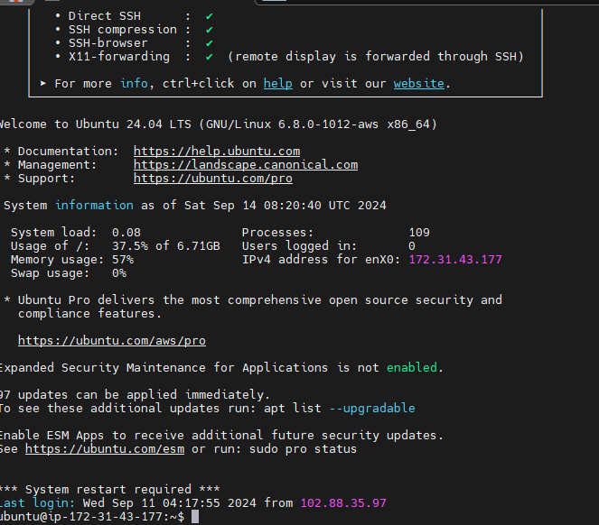
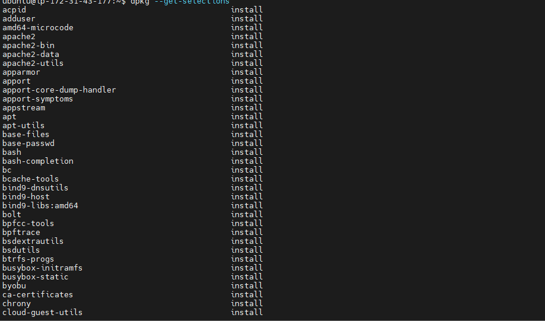

```markdown
# Github Link 
https://github.com/Gemjenny/StegDevOps
# Linkedin Post URL
https://www.linkedin.com/posts/activity-7239721427094953984-dQek?utm_source=share&utm_medium=member_android
```sql

```sql
ALTER USER 'root'@'localhost' IDENTIFIED WITH mysql_native_password BY 'PassWord.1';
```

```bash
sudo mysql_secure_installation
sudo apt install php libapache2-mod-php php-mysql
sudo mkdir /var/www/projectlamp
sudo chown -R $USER:$USER /var/www/projectlamp
```

```bash
sudo vi /etc/apache2/sites-available/projectlamp.conf
```

```apache
<VirtualHost *:80>
    ServerName projectlamp
    ServerAlias www.projectlamp
    ServerAdmin webmaster@localhost
    DocumentRoot /var/www/projectlamp
    ErrorLog ${APACHE_LOG_DIR}/error.log
    CustomLog ${APACHE_LOG_DIR}/access.log combined
</VirtualHost>
```

```bash
sudo a2ensite projectlamp
```

## Enabling PHP 
```bash
sudo vim /etc/apache2/mods-enabled/dir.conf
```
(Bring whatever index you want to direct to the front line)

```bash
sudo systemctl reload apache2
vim /var/www/projectlamp/index.php
```

```php
<?php
phpinfo();
?>
```

```bash
sudo rm /var/www/projectlamp/index.php
```
```

```bash






```
